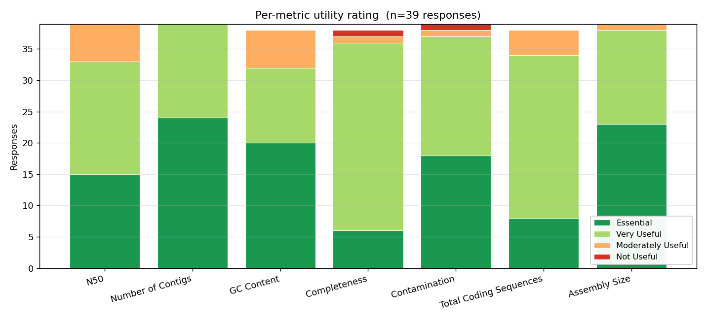
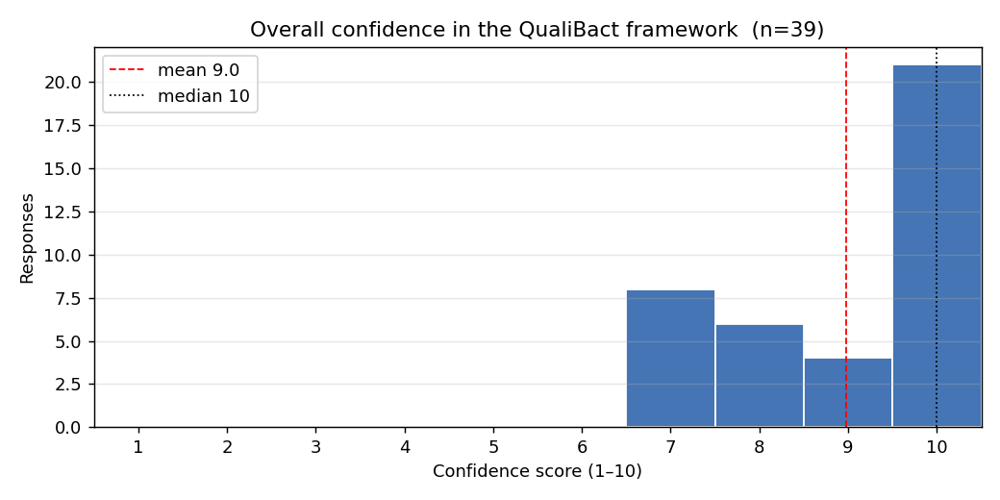
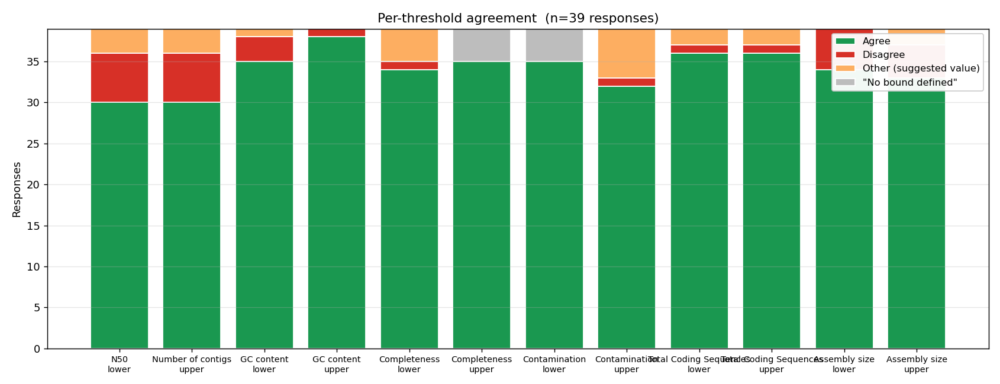

# QualiBact assessment survey — what the community told us

_Generic summary of the QualiBact threshold-assessment survey (collected between 10 November 2025 and 12 December 2025)._ This document is shareable with all respondents and contains no personally identifying information.

## At a glance

- **39** responses covering **37** species across **12** genera.
- Overall confidence: **mean 9.0 / 10**, median 10/10. 21 respondents (53%) gave the framework full marks.
- Strongest-rated metrics (% Essential + Very Useful): Number of Contigs, Assembly Size, Contamination, N50 — all above 90%.
- Most-contested thresholds: assembly size and N50 bounds (see per-threshold agreement chart below).

## How useful is each metric?

Each respondent rated each metric on a four-point scale (_Essential / Very Useful / Moderately Useful / Not Useful_).

| Metric | Essential | Very useful | Moderately useful | Not useful | n |
|---|---|---|---|---|---|
| N50 | 15 | 18 | 6 | 0 | 39 |
| Number of Contigs | 24 | 15 | 0 | 0 | 39 |
| GC Content | 20 | 12 | 6 | 0 | 38 |
| Completeness | 6 | 30 | 1 | 1 | 38 |
| Contamination | 18 | 19 | 1 | 1 | 39 |
| Total Coding Sequences | 8 | 26 | 4 | 0 | 38 |
| Assembly Size | 23 | 15 | 1 | 0 | 39 |

## Do you agree with the suggested threshold?

Per (metric, lower/upper bound), the response distribution. _Other_ counts respondents who suggested a specific alternate value in the explanation field (e.g. “we suggest 2.1 Mb instead of 2.0 Mb”). _“No bound defined”_ is when the curated threshold for that bound is left blank (common for upper Completeness, lower Contamination).

| Bound | Agree | Disagree | Other (alt. value) | “No bound defined” | n |
|---|---|---|---|---|---|
| N50 (lower) | 30 | 6 | 3 | 0 | 39 |
| Number of contigs (upper) | 30 | 6 | 3 | 0 | 39 |
| GC content (lower) | 35 | 3 | 1 | 0 | 39 |
| GC content (upper) | 38 | 1 | 0 | 0 | 39 |
| Completeness (lower) | 34 | 1 | 4 | 0 | 39 |
| Completeness (upper) | 35 | 0 | 0 | 4 | 39 |
| Contamination (lower) | 35 | 0 | 0 | 4 | 39 |
| Contamination (upper) | 32 | 1 | 6 | 0 | 39 |
| Total Coding Sequences (lower) | 36 | 1 | 2 | 0 | 39 |
| Total Coding Sequences (upper) | 36 | 1 | 2 | 0 | 39 |
| Assembly size (lower) | 34 | 5 | 0 | 0 | 39 |
| Assembly size (upper) | 33 | 4 | 2 | 0 | 39 |

## What other metrics would you find useful?

Free-text answers (with the requesting respondent's species in square brackets):

> _[Achromobacter xylosoxidans]_ Adding BUSCO might be useful

> _[Neisseria gonorrhoeae]_ We discussed that it is important to define the minimum length of a contig to be considered for the no_of_contigs and total_length metrics. Discarding contigs <1kb seems ok!

> _[Haemophilus influenzae]_ For all metrics, it would be useful to display median, IQR and perhaps 5-95% percentile

> _[Haemophilus haemolyticus]_ Median. IQR, 5-95% percentile; WARNING nrxt to PASS/FAIL

> _[Campylobacter coli]_ We think that it may be useful to know the contaminating species.

> _[Campylobacter jejuni]_ We think that it may be useful to know the contaminating species.

> _[Neisseria meningitidis]_ We think that it may be useful to know the contaminating species, as well as the minimum coverage depth.

> _[Staphylococcus aureus]_ Sequencing depth, heterozygous positions, Ns per 100 kbp

### Themes across these requests

| Theme | Mentions |
|---|---|
| Identity of contaminating species | 3 |
| Show median / IQR / percentiles | 2 |
| Sequencing depth / coverage | 2 |
| BUSCO completeness | 1 |
| Minimum contig length filter | 1 |
| PASS / WARNING / FAIL tiers | 1 |
| Heterozygous positions | 1 |
| Ns per 100 kbp | 1 |

## What QualiBact did with the feedback

- **Adjusted thresholds where experts pointed at specific values.** Examples shipped in qualibact-v1.1: *Campylobacter jejuni* assembly size upper raised from 2.0 Mb to 2.1 Mb (Alexandra Nunes & Mónica Oleastro, INSA); *Neisseria meningitidis* upper tightened from 2.4 Mb to 2.3 Mb (Alexandra Nunes & Célia Bettencourt, INSA).
- **Reference-set re-curation requests.** *Klebsiella grimontii* and *Staphylococcus coagulans* have engine re-runs queued. Misclassified-accession lists are being collected via direct correspondence.
- **Added a PASS / WARN / FAIL three-tier system.** Multiple respondents flagged that a single FAIL boundary is too coarse. The engine now emits a tighter WARN bound alongside the existing FAIL bound; the species page renders both.
- **Surfaced engine quality flags on the species page.** When the engine detects that the reference dataset for a species itself has issues (high contamination fraction, oversized genomes, wide GC range, etc.), a coloured banner now appears at the top of the species page with the engine's interpretation.
- **Read-level QC requests parked.** Sequencing depth, heterozygous positions, and Ns/100 kbp are out of scope for assembly-level QualiBact thresholds. We recommend [bactscout](https://github.com/cgps-group/bactscout) as the companion tool.
- **BUSCO completeness, identity of contaminating species.** These are out of scope for QualiBact's published thresholds, but downstream QC tools (CheckM2, sylph, kraken2) are where per-assembly contaminant identification belongs.

## Where the live thresholds live

- Species page: <https://qualibact.org/{Genus}/{Genus_species}/>
- Aggregate CSV (4-bound FINAL + WARN): <https://qualibact.org/api/v2/thresholds.csv>
- JSON shape: <https://qualibact.org/api/v2/thresholds.json>
- Methods: <https://qualibact.org/methods/qualibact-v1.1/>
- Per-WHO-list download: <https://qualibact.org/priority-pathogens/>
- Contributors (with your name when you contributed): <https://qualibact.org/contributors/>

---

_Report generated 2026-05-20. Survey responses collected between 10 November 2025 and 12 December 2025._
