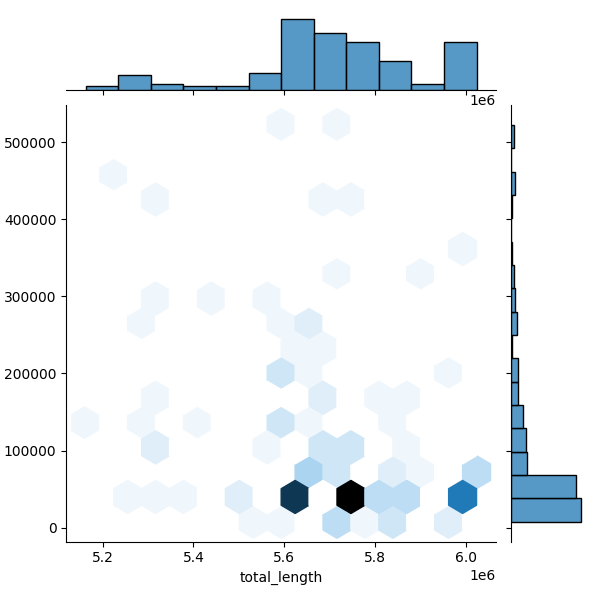
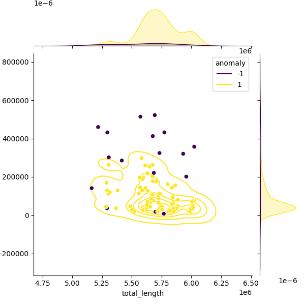
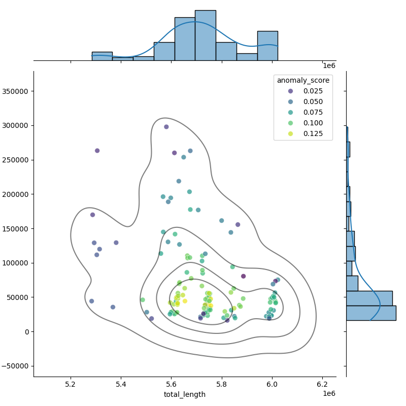

# *Bacillus mobilis*

This is the GenomeQC page for *Bacillus mobilis*. For detailed methods on how these thresholds were calculated, please see [Methods](../../methods.md).
The suggested thresholds are: 

| metric                 | lower_bounds   | upper_bounds   |
|:-----------------------|:---------------|:---------------|
| N50                    | 17000.0        |                |
| no_of_contigs          |                | 790.0          |
| GC_Content             | 35.0           | 36.0           |
| Completeness           | 100.0          |                |
| Contamination          |                | 2.0            |
| Total_Coding_Sequences | 5300.0         | 6300.0         |
| Genome_Size            | 5200000.0      | 6100000.0      |

[Download metrics CSV](Bacillus_mobilis_metrics.csv){.md-button}

These thresholds are based on **0** genomes from RefSeq and **148** genomes from ATB / SRA.

These thresholds were applied to all the bacteria dataset, which resulted in removing **7** and retaining **141**.
The list of genomes retained (i.e. high quality) and the list of genomes rejected (filtered) can be downloaded below. These files are in `.xz` format. The rejected genomes file, also includes the reason why.

[Download high quality genomes list](Bacillus_mobilis_high_quality_genomes.csv.xz)

[Download rejected genomes list](Bacillus_mobilis_filtered_out_genomes.csv.xz)

## Summary Tables
These tables provide a summary of the distribution of each metric, including SDeviation, Mean, Median, and Percentiles.

[Download full summary tables](summary.csv)

[Download simple summary tables](selected_summary.csv)

## Illustrating the filtering process
These plots illustrate the data, pre and post filtering to demostrate what type of outliers have been removed. While this was applied to metric, we will demonstrate using total assembly length and N50.
N50 vs total length for all genomes in the dataset.

N50 vs total length for genomes in the dataset, coloured according to whether they are an anomaly or not.

N50 vs total length post filtering on the dataset.

### Additional Plots

These plots provide additional insights into the genome characteristics:

- [N50 vs number of contigs, all genomes](Bacillus_mobilis_all_N50_number.png)
- [N50 vs number of contigs, sampled genomes](Bacillus_mobilis_sample_N50_number.png)
- [N50 vs number of contigs, filtered genomes](Bacillus_mobilis_filt_N50_number.png)
- [GC Content vs Total Length, all genomes](Bacillus_mobilis_all_total_length_GC_Content.png)
- [GC Content vs Total Length, sampled genomes](Bacillus_mobilis_sample_total_length_GC_Content.png)
- [GC Content vs Total Length, filtered genomes](Bacillus_mobilis_filt_total_length_GC_Content.png)
- [Longest Contig vs Total Length, all genomes](Bacillus_mobilis_all_total_length_longest.png)
- [Longest Contig vs Total Length, sampled genomes](Bacillus_mobilis_sample_total_length_longest.png)
- [Longest Contig vs Total Length, filtered genomes](Bacillus_mobilis_filt_total_length_longest.png)
