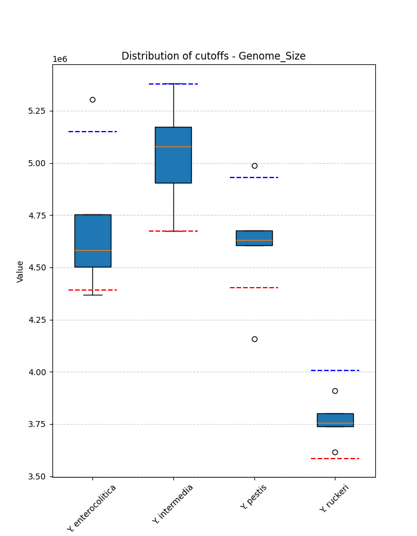
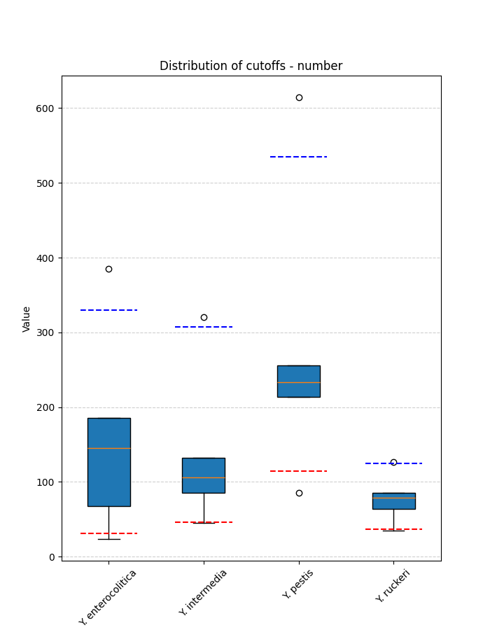

# *Yersinia* Overview
This page provides an overview of the genus, including links to species-specific pages and general information.

- [Species page: Yersinia enterocolitica](Yersinia_enterocolitica/index.md)
- [Species page: Yersinia pestis](Yersinia_pestis/index.md)
## Genus Species Count Summary
Breakdown of genomes filtered and retained by using these metrics:

| species                 |   original_count |   filtered_out_count |   final_count |
|:------------------------|-----------------:|---------------------:|--------------:|
| Yersinia_enterocolitica |             3356 |                  136 |          3220 |
| Yersinia_pestis         |             2362 |                  110 |          2252 |

[📊 Download species counts table](species_counts.csv){.md-button}
## Genus Summary Metrics
This section provides a summary of the metrics for the genus:

| species                 | metric                 |   lower_bounds |   upper_bounds |
|:------------------------|:-----------------------|---------------:|---------------:|
| Yersinia_pestis         | N50                    |    17000       |      nan       |
| Yersinia_pestis         | no_of_contigs          |      nan       |      540       |
| Yersinia_pestis         | GC_Content             |       47       |       48       |
| Yersinia_pestis         | Completeness           |       95       |      nan       |
| Yersinia_pestis         | Contamination          |      nan       |        2       |
| Yersinia_pestis         | Total_Coding_Sequences |     3900       |     4600       |
| Yersinia_pestis         | Genome_Size            |        4.4e+06 |        5e+06   |
| Yersinia_enterocolitica | N50                    |    34000       |      nan       |
| Yersinia_enterocolitica | no_of_contigs          |      nan       |      330       |
| Yersinia_enterocolitica | GC_Content             |       46       |       48       |
| Yersinia_enterocolitica | Completeness           |       92       |      nan       |
| Yersinia_enterocolitica | Contamination          |      nan       |        5       |
| Yersinia_enterocolitica | Total_Coding_Sequences |     4000       |     5000       |
| Yersinia_enterocolitica | Genome_Size            |        4.3e+06 |        5.2e+06 |

[📊 Download genus summary metrics table](genus_summary_metrics.csv){.md-button}
## Genus Visualizations
These plots show the main summary visualizations for this genus, including distributions of key genomic metrics such as genome size, GC content, number of contigs, and other relevant statistics. The boxplot for each species is based on the distribution (i.e. median, q1, q3, min and max) of the filtered genomes. The red line is the lower threshold and the blue line is the upper threshold. Use these plots to compare and explore the diversity and characteristics of genomes within this genus:

- [Distribution of Completeness for this genus](Completeness_Specific_boxplot_0.png)
- [Distribution of Contamination for this genus](Contamination_boxplot_0.png)
- [Distribution of Gc for this genus](GC_Content_boxplot_0.png)
- [Distribution of Genome for this genus](Genome_Size_boxplot_0.png)
- [Distribution of N50 for this genus](N50_boxplot_0.png)
- [Distribution of Total for this genus](Total_Coding_Sequences_boxplot_0.png)
- [Distribution of Longest for this genus](longest_boxplot_0.png)
- [Distribution of Number for this genus](number_boxplot_0.png)

